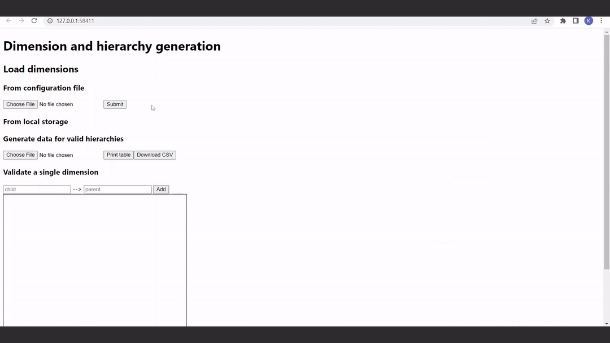
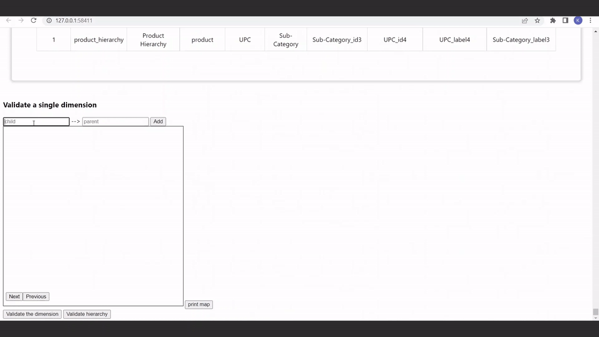

# Dimension and hierarchy generator
## Quick summary
This project is for generating data for a given hierarchy within a given dimension.
It validates the dimension as well as the hierarchy in the corresponding dimension.

The core features are implemented as an API endpoints and are explored by a front end web server.

Front end features:
- Validate dimensions from a CSV file input
- Validate hierarchies and generate data from a CSV file input
- Downloads the generated data as a CSV file format.
- Input a custom dimension and validate it
- Draws dimensions and hierarchies onto a canvas

## Set up
- No database is required
- The project is implemented in scala, spark and akka http.
- No configuration is required but note that the front end is exposed on port 80
- Deployed on kubernetes using the build.bat file
- Steps taken to deploy:
    - minikube start
    - execute the build.bat file with `./build.bat`
    - minikube tunnel

## Dimension validation

## Hierarchy validation and data generation

## Custom dimension

